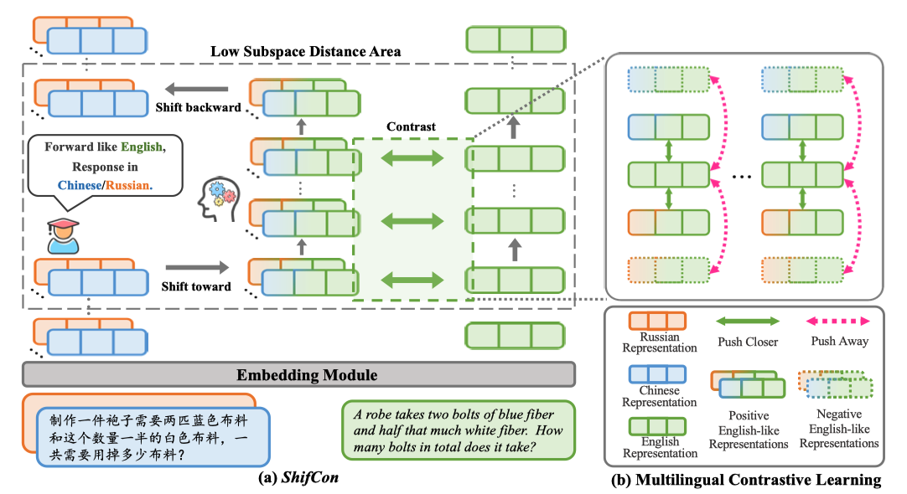

# ShifCon: Enhancing Non-Dominant Language capabilities with a Shift-based Contrastive Framework
This is the code repository of "ShifCon: Enhancing Non-Dominant Language capabilities with a Shift-based Contrastive Framework".

Our code and data will be publicly released soon! 

# 🚀 Introduction

To enhance the performance of non-dominant languages in LLMs, we propose a Shift-based Contrastive framework (ShifCon) that includes shift-toward and shift-backward projections, as well as multilingual contrastive learning (MCL).

